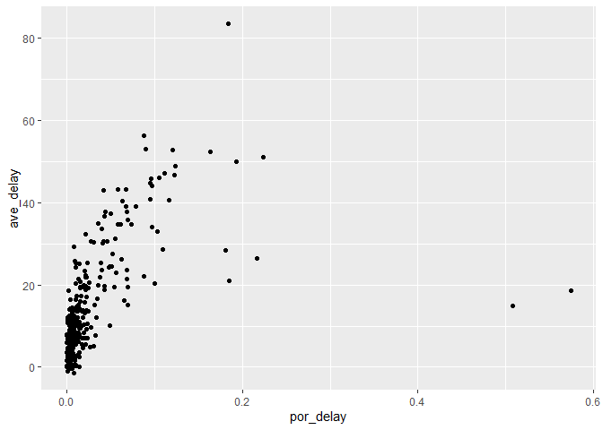

week3
================
Jingyun Jia
2021/9/28

github link: <https://github.com/Clouddelta/STAT433/blob/main/week3.md>

``` r
library(dplyr)
```

    ## 
    ## 载入程辑包：'dplyr'

    ## The following objects are masked from 'package:stats':
    ## 
    ##     filter, lag

    ## The following objects are masked from 'package:base':
    ## 
    ##     intersect, setdiff, setequal, union

``` r
library(nycflights13)
library(ggplot2)
#1
flights$dep_time%>%is.na%>%sum
```

    ## [1] 8255

``` r
#8255 items in dep_time are missing
flights%>%is.na%>%apply(MARGIN=2,FUN=sum)  
```

    ##           year          month            day       dep_time sched_dep_time 
    ##              0              0              0           8255              0 
    ##      dep_delay       arr_time sched_arr_time      arr_delay        carrier 
    ##           8255           8713              0           9430              0 
    ##         flight        tailnum         origin           dest       air_time 
    ##              0           2512              0              0           9430 
    ##       distance           hour         minute      time_hour 
    ##              0              0              0              0

``` r
##dep_time,dep_delay,arr_time,arr_delay,tailnum,air_time are missing
##The reason may be that flights were canceled

#2
flights%>%mutate(newdep_time=dep_time%/%100*60+dep_time%%100,
                 newsched_dep_time=sched_dep_time%/%100*60+sched_dep_time%%10)
```

    ## # A tibble: 336,776 x 21
    ##     year month   day dep_time sched_dep_time dep_delay arr_time sched_arr_time
    ##    <int> <int> <int>    <int>          <int>     <dbl>    <int>          <int>
    ##  1  2013     1     1      517            515         2      830            819
    ##  2  2013     1     1      533            529         4      850            830
    ##  3  2013     1     1      542            540         2      923            850
    ##  4  2013     1     1      544            545        -1     1004           1022
    ##  5  2013     1     1      554            600        -6      812            837
    ##  6  2013     1     1      554            558        -4      740            728
    ##  7  2013     1     1      555            600        -5      913            854
    ##  8  2013     1     1      557            600        -3      709            723
    ##  9  2013     1     1      557            600        -3      838            846
    ## 10  2013     1     1      558            600        -2      753            745
    ## # ... with 336,766 more rows, and 13 more variables: arr_delay <dbl>,
    ## #   carrier <chr>, flight <int>, tailnum <chr>, origin <chr>, dest <chr>,
    ## #   air_time <dbl>, distance <dbl>, hour <dbl>, minute <dbl>, time_hour <dttm>,
    ## #   newdep_time <dbl>, newsched_dep_time <dbl>

``` r
#make a transformation:n=n%/%100*60+n%%100
#for example:if dep_time=517,then new_dep_time=5*60+17(mins)

#3
#use missing value of dep_time as a criterion for the number of canceled flights
#first, we need to create a new column for each day the formula is:
##                ((month-1)*30+day,  since the year is all 2013)
flights%>%mutate(realday=(month-1)*30+day)%>%
  group_by(realday)%>%
  summarise(por_delay=sum(is.na(dep_time))/length(dep_time),ave_delay=mean(dep_delay,na.rm=1))%>%
  ggplot(aes(x=por_delay,y=ave_delay))+geom_point()
```

<!-- -->

``` r
##from the plot,there is a positive correlation between 
##      the portion of canceled and the average delay
```
