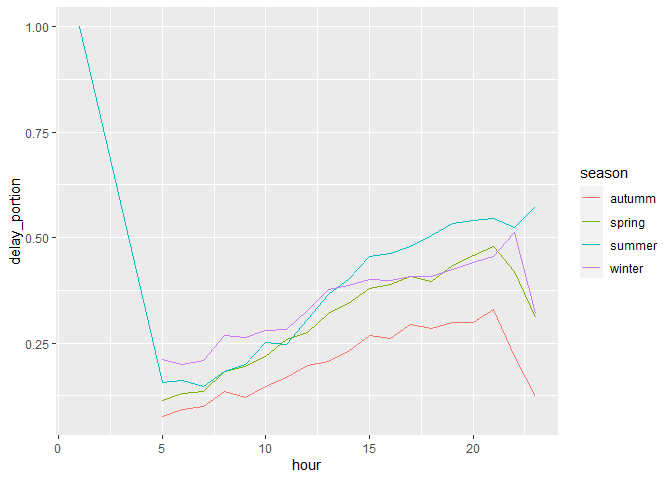
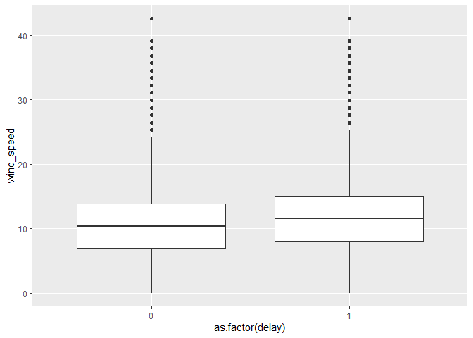

What time of day should you fly if you want to avoid delays as much as
possible?
================
Jingyun Jia
2021/10/5

# 1.Conclusion

1.  Autumm is the best season to fly in 2013.
2.  I recommend to fly before 10am in each season.
3.  In general cases, there is no apparent diference whether it is
    windy.(This is kind of weild.)

# 2.Some Preparations

I set a criterion for delay: if both dep\_delay and arr\_delay are
greater than zero, or it is NA, it is a delay flight. Then I add a
logical variable called ‘delay’ (0:not delay;1:delay).

``` r
library(nycflights13)
library(dplyr)
```

    ## 
    ## 载入程辑包：'dplyr'

    ## The following objects are masked from 'package:stats':
    ## 
    ##     filter, lag

    ## The following objects are masked from 'package:base':
    ## 
    ##     intersect, setdiff, setequal, union

``` r
library(lubridate)
```

    ## 
    ## 载入程辑包：'lubridate'

    ## The following objects are masked from 'package:base':
    ## 
    ##     date, intersect, setdiff, union

``` r
library(ggplot2)
library(tidyr)
library(hydroTSM)
```

    ## 载入需要的程辑包：zoo

    ## 
    ## 载入程辑包：'zoo'

    ## The following objects are masked from 'package:base':
    ## 
    ##     as.Date, as.Date.numeric

    ## 载入需要的程辑包：xts

    ## 
    ## 载入程辑包：'xts'

    ## The following objects are masked from 'package:dplyr':
    ## 
    ##     first, last

    ## 
    ## 载入程辑包：'hydroTSM'

    ## The following object is masked from 'package:tidyr':
    ## 
    ##     extract

``` r
weather1=weather%>%select(visib,wind_speed,precip,time_hour)
flights1=flights%>%left_join(weather1,by='time_hour')%>%
  mutate(delay=(dep_delay>0)*(arr_delay>0),season=time2season(time_hour,out.fmt="seasons"))
flights1$delay=flights1$delay%>%replace_na(1)
flights11=flights1%>%select(month,season,hour,visib,wind_speed,precip,delay)
```

# 3.Analysis

## 3.1.Season

I culculate the proportion of delay flights in each season and autumm
has a lowest proportion and there is a huge difference among autumm and
other seasons.

``` r
# hour
flights11%>%group_by(season)%>%summarise(delay_portion=sum(delay)/n()) 
```

    ## # A tibble: 4 x 2
    ##   season delay_portion
    ##   <chr>          <dbl>
    ## 1 autumm         0.208
    ## 2 spring         0.305
    ## 3 summer         0.354
    ## 4 winter         0.341

## 3.2.Hour(Interact with season)

I think this is the most important factor to cause delay, and it can
also influent weather. From the lineplot, the four lines show nearly the
same tendency, but in summer after 10pm, there is a upward tendency. In
addition, in the period of 0-5am, it is apparently some outliers since
the delay-proportion is 1.

``` r
# season,hour
flights11%>%group_by(hour,season)%>%summarise(delay_portion=sum(delay)/n())%>%ggplot()+geom_line(aes(x=hour,y=delay_portion,color=season)) 
```

    ## `summarise()` has grouped output by 'hour'. You can override using the `.groups` argument.

<!-- --> \#\#
3.2.Weather(Wind Speed) Actually, I want to explore more factors about
weather, but there is almost no difference in other weather variables.
For example, nearly all hours’ visible is 10 and all hours’
precipitation is 0. THerefore, I only choose one factor, wind speed, to
find some pattern. However, from the boxplot, there are no significant
differences between to groups.

``` r
# wind_speed
flights11%>%ggplot(aes(x=as.factor(delay),y=wind_speed))+geom_boxplot()
```

    ## Warning: Removed 1542 rows containing non-finite values (stat_boxplot).

<!-- -->
