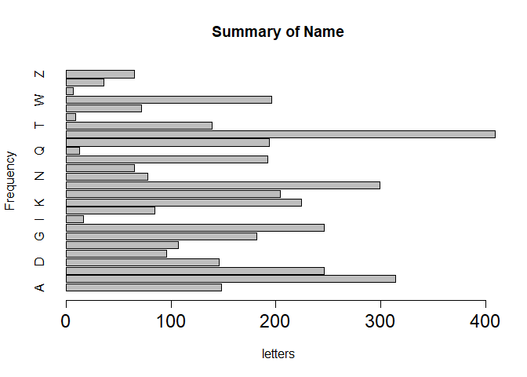

Week 2
================
Jingyun Jia
Sept 20, 2021

# Faculty data

## 4 Steps

### 1.Web Crawler

### 2.write.csv

### 3.str(info) and head(info)

### 4.make a barplot about the distribution of first letter in their names

link to github<https://github.com/Clouddelta/STAT433/blob/main/xx.Rmd>

``` r
options(knitr.duplicate.label = 'allow')
library(stringr)
library(xml2)
library(XML)
library(RCurl)
library(rvest)
library(dplyr)
```

    ## 
    ## 载入程辑包：'dplyr'

    ## The following objects are masked from 'package:stats':
    ## 
    ##     filter, lag

    ## The following objects are masked from 'package:base':
    ## 
    ##     intersect, setdiff, setequal, union

``` r
library(ggplot2)
faculty_inf=data.frame()
web=read_html("https://guide.wisc.edu/faculty/")
l=3789## the amount of faculty
name=web%>%html_nodes(xpath="//ul[@class='uw-people']/li/p/text()[1]")%>%html_text()
position=web%>%html_nodes(xpath="//ul[@class='uw-people']/li/p/text()[2]")%>%html_text()
major=web%>%html_nodes(xpath="//ul[@class='uw-people']/li/p/text()[3]")%>%html_text()
degree=html_node(html_nodes(web,xpath="//*[@id='textcontainer']/ul/li/p"),xpath='text()[4]')%>%html_text()##to add missing value as NA, or the length of this vector will be 3736.
info=data.frame(cbind(name,position,major,degree))
#write.csv(info,'xx.csv')
head(info)
```

    ##                   name              position                   major
    ## 1      ABBOTT,DAVID H.             Professor Obstetrics & Gynecology
    ## 2   ABD-ELSAYED,ALAA A Assoc Professor (Chs)          Anesthesiology
    ## 3     ABDUALLAH,FAISAL             Professor                     Art
    ## 4 ABRAHAM,OLUFUNMILOLA   Assistant Professor                Pharmacy
    ## 5      ABRAMS,SAMANTHA        Assoc Lecturer      Information School
    ## 6         ABRAMSON,LYN             Professor              Psychology
    ##                                degree
    ## 1    PHD 1979 University of Edinburgh
    ## 2        MD 2000 University of Assiut
    ## 3       PHD 2012 Royal College of Art
    ## 4  PHD 2013 Univ of Wisconsin-Madison
    ## 5   MA 2017 Univ of Wisconsin-Madison
    ## 6 PHD 1978 University of Pennsylvania

``` r
str(info)
```

    ## 'data.frame':    3789 obs. of  4 variables:
    ##  $ name    : chr  "ABBOTT,DAVID H." "ABD-ELSAYED,ALAA A" "ABDUALLAH,FAISAL" "ABRAHAM,OLUFUNMILOLA" ...
    ##  $ position: chr  "Professor" "Assoc Professor (Chs)" "Professor" "Assistant Professor" ...
    ##  $ major   : chr  "Obstetrics & Gynecology" "Anesthesiology" "Art" "Pharmacy" ...
    ##  $ degree  : chr  "PHD 1979 University of Edinburgh" "MD 2000 University of Assiut" "PHD 2012 Royal College of Art" "PHD 2013 Univ of Wisconsin-Madison" ...

``` r
summaryofname=table(substring(info$name,1,1))
barplot(summaryofname,main="Summary of Name",xlab="letters",ylab="Frequency",horiz=1,cex.axis=1.5)
```

<!-- -->
